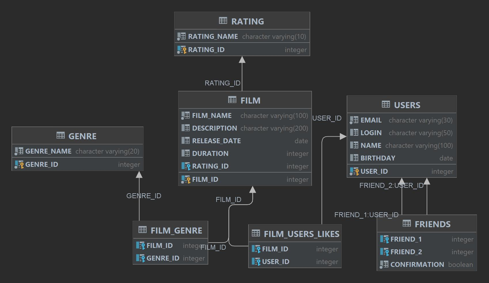

# java-filmorate
ER-диаграмма:

Основные запросы. Конечно я их не тестировал, но логика примерно такая
1) Показать список всех фильмов.

SELECT *

FROM FILM;
2) Получение конкретного юзера по ID

SELECT NAME AS name

FROM USERS

WHERE USER_ID = <тут номер ID>

3) Получить топ-10 фильмов.

SELECT f.FILM_NAME AS name,

COUNT(l.USER_ID) AS likes

FROM FILM AS f

LEFT JOIN FILM_USER_LIKES AS l ON f.FILM_ID=l.FILM_ID

GROUP BY name

ORDER BY likes DESC

LIMIT_10;

4) Получение списка общих друзей с другим пользователем

SELECT f2.FRIEND_2 AS common_friends

FROM USERS AS u2

LEFT JOIN FRIENDS AS f2 ON u2.USER_ID = f2.FRIEND_1

WHERE u2.USER_ID = <тут номер второго пользователя>

AND

common_friends = (SELECT f1.FRIEND_2

FROM USERS AS u1

LEFT JOIN FRIENDS AS f1 ON u1.USER_ID = f1.FRIEND_1

WHERE u1.USER_ID = <тут номер первого пользователя>) AS friend1;
